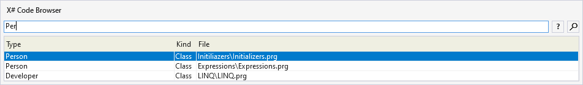
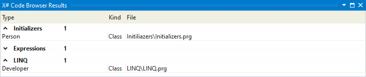
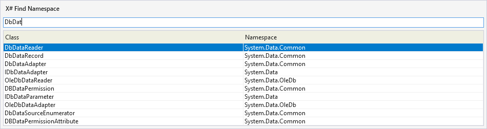

# X# PowerTools

---------------------------------------

A set of tools for [X#](https://www.xsharp.eu) developers

## Features

- Code Browser
- Find and insert Namespaces

There are no default shortcuts assigned, but you can easily assign shortcuts  yourself by following this [tutorial](https://docs.microsoft.com/en-us/visualstudio/ide/identifying-and-customizing-keyboard-shortcuts-in-visual-studio?view=vs-2019)

### Code Browser

The Code Browser allows to easily navigate within a solution containing X#-projects.

It offers various options to filter the search results:

- example		- searches for classes with names similar to 'example'
- ex1.ex2		- searches for members similar to 'ex2' within classes similar to 'ex1' ('.' equal to ':')
- .example	    - searches for members 'example' within all classes
- ..example	    - searches for members 'example' within current document
- "example"     - matches whole word only
- ex*Model      - * is a placeholder for multiple characters
- p example     - searches for procedures/functions similar to 'example'
- d example     - searches for defines similar to 'example'

By pressing Return or double-clicking the implementation of the selected element will be opened in the editor.

By pressing Ctrl + Return or clicking the top-right button the found results are exported into a dockable Visual Studio Toolwindow where results are grouped by the containing project.

### Find and insert Namespaces

Find and insert Namespaces makes it easy to find the containing Namespace of a type and insert the corresponding using at top of the current document if necessary.

